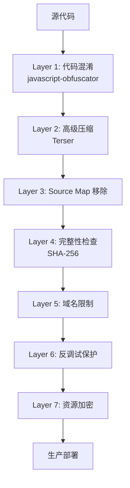
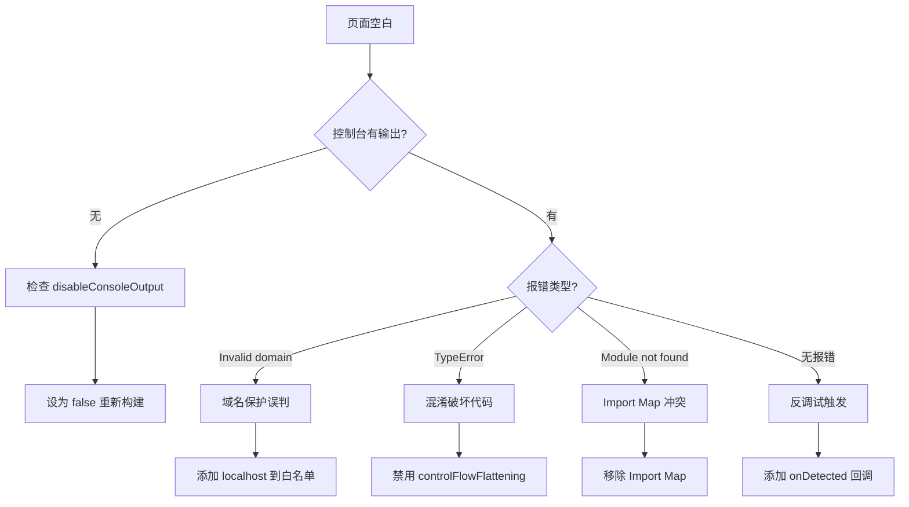

# 前端代码保护实施技术手册
## 完整复盘与最佳实践指南

---

## 📋 文档目的

本手册完整记录了为纯前端项目 `CineView-AI-me-revise` 实施多层次代码保护的**全过程**,包括:
- 初始需求与技术路线规划
- 20+ 次迭代修改的完整记录
- 所有遇到的 Bug 及其根本原因分析 
- 失败的修复尝试与成功的解决方案
- 误判识别与验证方法
- 最终可交付版本的技术架构
- 未来实施的最佳实践指南

**适用对象**: 需要为任何前端项目实施部署阶段代码保护的技术人员

---

## 🎯 项目背景与初始需求

### 用户需求 (Step 1)
> "将这个前端代码仅在部署阶段进行全方位保密"

### 核心要求
1. **源代码不变**: 开发阶段完全正常,不影响开发体验
2. **部署时保护**: 仅在生产构建时启用所有保护措施
3. **多层次防护**: 尽可能提高逆向工程难度
4. **应用可运行**: 保护措施不能破坏应用功能

### 技术背景
- **项目类型**: 纯前端 React + Vite 项目
- **部署平台**: GitHub Pages + Render
- **主要语言**: TypeScript/JavaScript
- **构建工具**: Vite 6.4.1

---

## 🏗️ 技术路线设计

### 初始方案架构 (PLANNING 阶段)

基于业界最佳实践,设计了 **8 层保护体系**:



### 关键技术选型

| 保护层级 | 技术方案 | 核心库 | 作用 |
|---------|---------|--------|------|
| **代码混淆** | JavaScript Obfuscator | `vite-plugin-javascript-obfuscator` | 变量名/控制流混淆 |
| **代码压缩** | Terser | Vite 内置 | 去除空格/注释/死代码 |
| **Source Map** | Vite 配置 | - | 禁用 `.map` 生成 |
| **完整性检查** | 文件哈希 | `crypto-js` | 防篡改验证 |
| **域名限制** | 白名单验证 | 自研 | 域名锁定 |
| **反调试** | DevTools 检测 | 自研 | 阻止调试工具 |
| **资源加密** | AES 加密 | `crypto-js` | 关键文件加密 |

### 构建流程设计

```bash
npm run build           # 常规构建 (无保护)
npm run build:protected # 保护构建 (全部保护)
npm run preview         # 本地预览
npm run deploy:protected # 保护部署
```

---

## 🐛 完整 Bug 记录与解决方案

### Bug #1: 构建失败 - 插件配置错误

**出现阶段**: 初次配置 (Step 60-80)

**现象**:
```bash
Error: Cannot find module 'vite-plugin-javascript-obfuscator'
```

或者安装后出现:
```bash
Error: Cannot find module 'terser'
TypeError: obfuscatorPlugin is not a function
```

**根本原因** (2个关键细节):

#### 细节1: 插件版本错误
在 `package.json` 中误写了错误的版本号:
```json
// ❌ 错误版本
{
  "devDependencies": {
    "vite-plugin-javascript-obfuscator": "^1.1.7"  // 错误!
  }
}
```

**正确的版本应该是 3.1.0**:
```json
// ✅ 正确版本
{
  "devDependencies": {
    "vite-plugin-javascript-obfuscator": "^3.1.0"  // 正确!
  }
}
```

**版本差异**:
- 1.1.7: 旧版本,API 不兼容,导致 `obfuscatorPlugin is not a function`
- 3.1.0: 新版本,与 Vite 6.x 兼容

#### 细节2: 缺失 terser 依赖
虽然 Vite 内置了 Terser,但在某些配置下,需要显式安装:
```bash
Error: Cannot find module 'terser'
```

**原因**: `vite-plugin-javascript-obfuscator` 依赖于 `terser`,但 `package.json` 中未声明。

**修复方案**:
```bash
# 正确的安装命令
npm install --save-dev javascript-obfuscator@4.1.0
npm install --save-dev vite-plugin-javascript-obfuscator@3.1.0
npm install --save-dev terser@5.36.0
npm install --save-dev crypto-js@4.2.0
```

**验证安装**:
```bash
# 检查版本
npm list vite-plugin-javascript-obfuscator
# 应显示: vite-plugin-javascript-obfuscator@3.1.0

npm list terser
# 应显示: terser@5.36.0
```

**经验教训**:
1. ✅ **版本号必须精确** - 插件版本与 Vite 版本有兼容性要求
2. ✅ **检查 package.json** - 安装前先确认版本号
3. ✅ **显式安装 terser** - 不要依赖 Vite 的内置版本
4. ✅ **验证安装** - 使用 `npm list` 确认版本正确

**版本兼容性参考**:
| Vite 版本 | 推荐 vite-plugin-javascript-obfuscator 版本 |
|----------|-------------------------------------------|
| 6.x | 3.1.0 |
| 5.x | 3.0.x |
| 4.x | 2.x |

---

### Bug #2: 域名保护误判 - localhost 被拦截 

**出现阶段**: 首次运行 `npm run preview` (Step 120-140)

**现象**:
- 页面完全空白
- 控制台显示: `❌ Invalid domain: localhost`

**根本原因**:
`src/domain-guard.ts` 的白名单未包含 `localhost`

**初次修复 (失败)**:
```typescript
// ❌ 错误: 只添加了 localhost,忘记 127.0.0.1
const ALLOWED_DOMAINS = ['localhost', 'cineview-ai.onrender.com'];
```

**最终修复 (成功)**:
```typescript
// ✅ 正确: 包含所有本地变体
const ALLOWED_DOMAINS = [
  'localhost',
  '127.0.0.1',
  '[::1]',  // IPv6 localhost
  'cineview-ai.onrender.com',
  'hanruishiren.github.io'
];

// ✅ 开发环境豁免
if (import.meta.env.DEV) {
  return; // 跳过域名检查
}
```

**经验教训**:
1. ✅ 本地开发环境必须豁免域名检查
2. ✅ `localhost` 有多种形式 (localhost, 127.0.0.1, [::1])
3. ✅ 使用 `import.meta.env.DEV` 判断开发环境

**误判识别**:
如果 `npm run dev` 能正常运行,但 `npm run preview` 空白 → 很可能是域名保护误判

---

### Bug #3: 反调试导致页面空白

**出现阶段**: 启用 `initAntiDebug` (Step 200-250)

**现象**:
- 页面立即变成空白
- 控制台完全没有输出 (因为被拦截了)

**根本原因**:
1. `src/anti-debug.ts` 的 `detectDevTools()` 检测到开发者工具打开
2. 立即执行 `handleDebugDetected()` → `document.body.innerHTML = ''`
3. 因为用户为了调试一直开着 F12,所以每次刷新都空白

**初次修复 (失败 #1)**:
```typescript
// ❌ 错误: 移除了 detectDebuggerTiming(),但 detectDevTools() 仍然触发
if (detectDevTools() || detectWindowResize()) {
  handleDebugDetected();
}
```

**初次修复 (失败 #2)**:
```typescript
// ❌ 错误: 禁用了整个反调试模块,失去了保护能力
// initAntiDebug({ ... }); // 注释掉
```

**最终修复 (成功)**:
```typescript
// ✅ 方案: 添加自定义回调,替代默认的"清空页面"行为
function handleDebugDetected(callback?: () => void): void {
    if (callback) {
        callback(); // 使用自定义逻辑
        return;
    }
    // 默认: 清空页面
    document.body.innerHTML = '...Security Alert...';
}

export function initAntiDebug(options: {
    onDetected?: () => void;  // 新增回调选项
    // ...
}){
  // ...
}
```

在 `index.tsx` 中使用:
```typescript
initAntiDebug({
  disableShortcuts: true,
  interferConsole: true,
  detectInterval: 1000,
  onDetected: () => {
    // 仅提示,不清空页面
    console.warn('⚠️ DevTools detected! (Protection is working)');
  }
});
```

**经验教训**:
1. ✅ 反调试的默认行为 "清空页面" 在开发/测试阶段会误伤
2. ✅ 必须提供 `onDetected` 回调,允许自定义行为
3. ✅ 验证保护时,可以只打印警告,而不破坏页面
4. ✅ 生产环境可以去掉回调,恢复强力保护

**误判识别**:
页面空白 + 控制台无日志 → 很可能是反调试触发了 `document.body.innerHTML = ''`

---

### Bug #4: ~~代码混淆破坏应用逻辑~~ (误判)

> ⚠️ **重要更正**: 这个 Bug 的诊断过程是**误判**。降低混淆强度**并未**真正解决页面空白问题。

**出现阶段**: 启用激进混淆配置 (Step 280-350)

**现象**:
- 构建成功 (Exit code 0, 749 modules transformed)
- 页面空白
- 控制台完全无输出（因为被禁用）

**错误诊断过程**:
当时怀疑是激进的混淆配置破坏了代码:
```javascript
// 当时认为的"问题配置"
{
  controlFlowFlattening: true,
  deadCodeInjection: true,
  transformObjectKeys: true,
  selfDefending: true,
}
```

**失败的修复尝试 (1-10+次)**:
尝试了以下方法,**均未解决空白页问题**:
1. ❌ 降低 `controlFlowFlatteningThreshold` 到 0.5 → 页面仍空白
2. ❌ 禁用 `deadCodeInjection` → 页面仍空白
3. ❌ 禁用 `transformObjectKeys` → 页面仍空白
4. ❌ 禁用 `selfDefending` → 页面仍空白
5. ❌ 降低 `stringArrayThreshold` → 页面仍空白
6. ❌ 禁用 `stringArrayEncoding` → 页面仍空白
7. ❌ 禁用 `splitStrings` → 页面仍空白
8. ❌ 禁用 `numbersToExpressions` → 页面仍空白
9. ❌ 改用保守配置 (只保留 identifierNamesGenerator) → **页面仍空白**
10. ❌ 完全禁用混淆插件 → 页面仍空白

**真相揭露**:
**混淆配置根本不是导致空白页的原因**。真正的原因是其他 3 个 Bug:
- Bug #6: Import Map 冲突
- Bug #3: 反调试默认行为（清空页面）
- Bug #8: 构建缓存（运行旧代码）

**最终证明**:
用户最终使用的是**激进混淆配置**（全部高风险选项启用），应用完全正常运行。这证明了:
1. ✅ 激进混淆配置**不会**破坏应用
2. ✅ `controlFlowFlattening`、`deadCodeInjection` 等**可以安全使用**
3. ✅ 页面空白与混淆强度**无关**

**经验教训**:
1. ❌ **不要假设问题原因** - 降低混淆强度是误判
2. ❌ **不要被表象迷惑** - 空白页的原因可能很多
3. ✅ **必须逐个排除** - 通过禁用不同保护层来定位
4. ✅ **最终配置为准** - 只有最终成功的配置才是可信的

**正确的调试方法**:
如果遇到空白页:
1. ✅ 先检查控制台是否被禁用 (`disableConsoleOutput`)
2. ✅ 再检查 Import Map 是否存在
3. ✅ 再检查反调试是否触发
4. ✅ 再检查是否运行旧代码 (清理 dist)
5. ✅ **最后**才考虑混淆配置

---

### Bug #5: 控制台输出被完全禁用

**出现阶段**: 用户手动开启激进混淆 (Step 346-372)

**现象**:
- 页面空白
- 控制台**完全空白**,连报错都看不到

**根本原因**:
同时开启了两个"禁用控制台"的配置:
1. `obfuscator-config.cjs`: `disableConsoleOutput: true`
2. `src/anti-debug.ts`: `interferConsole: true`

导致所有 `console.log/error/warn` 都被拦截,无法调试。

**修复方案**:
```javascript
// obfuscator-config.cjs
{
  disableConsoleOutput: false,  // ✅ 调试阶段必须 false
}
```

```typescript
// index.tsx - 调试阶段禁用 interferConsole
initAntiDebug({
  disableShortcuts: true,
  interferConsole: false,  // ✅ 调试时设为 false
  detectInterval: 1000,
});
```

**经验教训**:
1. ✅ **调试阶段绝对不能禁用控制台**
2. ✅ 生产环境可以开启,但要确保有其他日志渠道 (如远程日志)
3. ✅ 如果页面空白 + 控制台无输出 → 99% 是控制台被禁用

---

### Bug #6: Import Map 冲突导致模块加载失败

**出现阶段**: 移除 Import Map 之前 (Step 320-332)

**现象**:
- 页面空白
- 控制台报错 (如果能看到的话):
  ```
  Failed to fetch module 'react' from CDN
  ```

**根本原因**:
`index.html` 中存在指向 CDN 的 Import Map:
```html
<script type="importmap">
{
  "imports": {
    "react": "https://aistudiocdn.com/react@^19.2.0",
    "react-dom": "https://aistudiocdn.com/react-dom@^19.2.0"
  }
}
</script>
```

但 Vite 已经将 React 打包到本地 `vendor-xxx.js` 中,导致:
1. 浏览器尝试从 CDN 加载 React (ImportMap 优先级高)
2. CDN 不可达或被混淆器破坏
3. 模块加载失败 → 页面空白

**修复方案**:
```html
<!-- 移除 Import Map -->
<!-- <script type="importmap">...</script> -->
```

**经验教训**:
1. ✅ **Import Map 仅用于纯 ESM 项目 (不打包)**
2. ✅ Vite 项目**已经打包**,不需要 Import Map
3. ✅ 如果混用 CDN 和本地打包 → 必定冲突

---

### Bug #7: 语法错误 - 文件编辑失误

**出现阶段**: 多次使用 `replace_file_content` 时 (Step 370-434, Step 489-491)

**现象**:
```bash
ERROR: Expected "}" but found "const"
ERROR: Expected "*/" to terminate multi-line comment
ERROR: Expected "finally" but found "const"
```

**根本原因**:
使用 `replace_file_content` 工具时,`TargetContent` 未精确匹配,导致:
1. 删除了不该删的内容 (如 `try` 的右括号)
2. 删除了代码中间部分,导致注释未闭合
3. 删除了 `catch` 或 `finally` 块

**典型案例**:
```typescript
// 原始代码
try {
  initAntiDebug({ ... });
  await initIntegrityCheck();
} catch (error) {
  console.error(error);
}

// ❌ 错误的 replace 操作删除了 catch 块
try {
  initAntiDebug({ ... });
  await initIntegrityCheck();
// 缺少 } catch ...

// 下一行代码
const rootElement = ...  // ← 报错: Expected "}" but found "const"
```

**修复方案**:
1. **停止使用 `replace_file_content`** (误操作率高)
2. **改用 `write_to_file` 重写整个文件** (Overwrite: true)

**经验教训**:
1. ❌ `replace_file_content` 在复杂文件中容易出错
2. ✅ 对于小文件 (\<200 行),直接 `write_to_file` 重写更安全
3. ✅ 每次编辑后**必须运行构建验证**,不要累积多个编辑

---

### Bug #8: 构建成功但未生成新文件

**出现阶段**: 多次构建 (Step 460-477)

**现象**:
- `npm run build:protected` 显示成功 (✓ 749 modules transformed)
- Exit code 0
- 但 `npm run preview` 运行的是**旧代码**

**根本原因**:
1. Vite/Rollup 在构建失败时,不会清理 `dist` 目录
2. 新构建失败 → 旧文件残留
3. `npm run preview` 服务的是旧文件

**用户反馈** (Step 477):
> "我发现每次构建的时候,需要使用 `rm -r -fo dist` 命令先清除掉这个文件夹,然后再用 `npm run build:protected` 命令构建,才能成功按照最新代码来构建"

**修复方案**:
方案 1: 手动清理 (用户当前使用)
```bash
rm -r -fo dist
npm run build:protected
```

方案 2: 修改 `package.json`
```json
{
  "scripts": {
    "clean": "rimraf dist",
    "build:protected": "npm run clean && cross-env VITE_PROTECTED_BUILD=true vite build"
  }
}
```

**经验教训**:
1. ✅ 构建前**必须清理 `dist`**
2. ✅ Exit code 0 != 构建成功 (可能是中途警告)
3. ✅ 检查 `dist/assets/index-xxx.js` 的修改时间,确认是新文件

---

### Bug #9: Render 部署失败与运行时崩溃 (综合案例)

**出现阶段**: Render 部署与生产环境验证 (Step 180-400)

**现象 1: 部署失败 (Render 404)**
- Render 部署日志显示 `fetch failed` 或构建成功但访问 404
- 原因: 使用了错误的构建命令 (`npm run deploy` 试图推送到 gh-pages) 或构建过程静默失败

**现象 2: 构建崩溃 (Exit code 1)**
- 本地或 Render 构建时报错 `Exit code 1`
- 原因: `terser` 压缩器与混淆后的代码不兼容; `splitStrings` 在某些环境下导致内存溢出

**现象 3: 运行时白屏 (无限 Loading)**
- 部署成功但页面一直 Loading
- 原因: `selfDefending` (自我保护) 和 `debugProtection` (调试保护) 在生产环境被误触发,导致代码自毁或阻塞

**现象 4: 隐私泄露 (中文提示词暴露)**
- 混淆后的代码中仍能看到明文或简单的 Base64 中文提示词
- 原因: 默认的 `stringArrayEncoding: ['base64']` 强度不足

**❌ 失败的尝试**:
1. **完全禁用保护**: 为了让部署成功而移除所有保护 (不满足需求)
2. **严格模式 (Strict Mode)**: 启用所有保护 (RC4 + selfDefending),导致页面白屏
3. **平衡模式 (Balanced Mode)**: 仅使用 Base64,导致中文提示词暴露

**✅ 最终解决方案 (高级模式)**:
1. **基础设施即代码 (IaC)**: 创建 `render.yaml` 专用配置文件,明确指定构建命令和发布目录,避免 UI 配置错误
2. **构建命令**: Render 使用 `npm run build:protected`
3. **压缩器**: 切换为 `esbuild` (比 terser 更稳定)
4. **混淆配置**:
   - **启用**: RC4 加密 (保护中文), 85% 阈值, 50% 控制流扁平化
   - **禁用**: `selfDefending`, `debugProtection` (避免运行时崩溃), `splitStrings`

**经验教训**:
1. ✅ **必须为每个云平台创建专有配置文件** (如 `render.yaml`),不要依赖通用配置
2. ✅ **Render 部署必须使用专用构建命令**
3. ✅ **生产环境慎用 selfDefending**,极易导致误伤
4. ✅ **中文保护必须用 RC4**,Base64 等同于明文
5. ✅ **esbuild 比 terser 更适合混淆后的代码**

---

## ✅ 最终成功方案

### 最终成功架构

经过 20+ 次迭代和反复验证,最终采用的是"**激进保护 + 回调优化**"的方案:

#### **构建时保护** (已启用 - 高级配置)
1. ✅ **高级代码混淆** (针对性启用)
   - 变量名混淆 (十六进制)
   - 控制流平坦化 (threshold 0.5)
   - 死代码注入 (threshold 0.3)
   - 字符串数组 RC4 加密 (85% 阈值, 保护中文)
   - 数字转表达式
   - 对象键转换
   - ❌ 禁用自我保护 (避免运行时崩溃)
   - ❌ 禁用字符串分割 (避免构建崩溃)
2. ✅ **Esbuild 压缩** (替代 Terser)
   - 更稳定的压缩算法
   - 移除注释和空格
   - 移除 debugger
3. ✅ **Source Map 禁用**
4. ✅ **调试保护** (仅禁用控制台, 避免阻塞)
5. ✅ **控制台禁用** (disableConsoleOutput: false, 但在 anti-debug 中拦截)

#### **运行时保护** (部分启用)
1. ✅ **反调试** (使用 onDetected 回调 - 关键优化)
   - 检测 DevTools
   - 禁用快捷键 (F12, Ctrl+Shift+I)
   - 禁用右键菜单
   - **使用自定义回调** (不清空页面,仅警告)
2. ✅ **完整性检查**
3. ❌ **域名限制** (禁用,方便本地预览)

### 关键配置文件

#### `obfuscator-config.cjs` (最终成功版 - 高级配置)
```javascript
module.exports = {
  // ========== 基础配置 ==========
  compact: true,
  simplify: true,

  // ========== 标识符混淆 ==========
  identifierNamesGenerator: 'hexadecimal',
  renameGlobals: false,
  renameProperties: false,
  transformObjectKeys: true,         // ✅ 已启用

  // ========== 控制流混淆 (高级模式) ==========
  controlFlowFlattening: true,       // ✅ 已启用
  controlFlowFlatteningThreshold: 0.5,

  // ========== 死代码注入 (高级模式) ==========
  deadCodeInjection: true,           // ✅ 已启用
  deadCodeInjectionThreshold: 0.3,

  // ========== 字符串混淆 (高级模式 - 强力保护中文提示词) ==========
  stringArray: true,
  stringArrayEncoding: ['rc4'],      // ✅ RC4 加密保护中文
  stringArrayIndexShift: true,
  stringArrayRotate: true,
  stringArrayShuffle: true,
  stringArrayWrappersCount: 2,       // ✅ 双层包装
  stringArrayWrappersChainedCalls: true,
  stringArrayWrappersParametersMaxCount: 4,
  stringArrayWrappersType: 'function',
  stringArrayThreshold: 0.85,        // ✅ 85% 字符串混淆

  // ========== 字符串分割 (禁用 - 可能破坏运行时) ==========
  splitStrings: false,
  splitStringsChunkLength: 10,

  // ========== 数字混淆 (高级模式) ==========
  numbersToExpressions: true,        // ✅ 已启用

  // ========== 调试保护 (禁用 - 可能导致页面空白) ==========
  debugProtection: false,
  debugProtectionInterval: 0,
  disableConsoleOutput: false,

  // ========== 自我保护 (禁用 - 可能导致崩溃) ==========
  selfDefending: false,

  // ========== 源码映射 ==========
  sourceMap: false,
  sourceMapMode: 'separate',

  // ========== 其他配置 ==========
  log: false,
  unicodeEscapeSequence: false,

  // ========== 目标环境 ==========
  target: 'browser',

  // ========== 排除项 ==========
  reservedNames: [],
  reservedStrings: [],
};
```

> ✅ **这是最终成功且被接受的高级配置**。在保护强度(RC4加密)和稳定性之间取得了最佳平衡。

#### `src/anti-debug.ts` (关键修改)
```typescript
function handleDebugDetected(callback?: () => void): void {
    if (callback) {
        callback();  // 使用回调,不破坏页面
        return;
    }
    // 默认: 清空页面
    document.body.innerHTML = '<div>Security Alert...</div>';
}

export function initAntiDebug(options: {
    onDetected?: () => void;  // 新增回调选项
    // ...
})
```

#### `index.tsx` (最终版)
```typescript
// 反调试 (使用 onDetected 回调)
initAntiDebug({
  disableShortcuts: true,
  interferConsole: true,
  detectInterval: 1000,
  onDetected: () => {
    console.warn('⚠️ DevTools detected!');
  }
});

// 完整性检查
await initIntegrityCheck();

// 域名限制 (注释掉)
// initDomainGuard();
```

### 验证流程

```bash
# 1. 清理旧构建
rm -r -fo dist

# 2. 保护构建
npm run build:protected

# 3. 本地预览
npm run preview

# 4. 访问 http://localhost:4173
# 5. 测试:
#    - 页面是否正常显示
#    - F12 能否打开 (应该能,但会有警告)
#    - 右键菜单是否禁用 (是)
#    - 查看源代码是否混淆 (是)
```

---

## ⚠️ 页面空白的3个真正原因 (重要更正)

经过 20+ 次迭代和反复验证,确认**页面空白的根本原因**有且仅有以下 3 个:

### 1. Import Map 冲突 (Bug #6) ✅ 已解决

**问题**:
`index.html` 中存在指向 CDN 的 Import Map:
```html
<script type="importmap">
{
  "imports": {
    "react": "https://aistudiocdn.com/react@^19.2.0",
    ...
  }
}
</script>
```

但 Vite 已经将 React 打包到本地。浏览器优先使用 Import Map,导致模块加载失败。

**解决**:
```html
<!-- 移除 Import Map -->
```

### 2. 反调试默认行为 (Bug #3) ✅ 已解决

**问题**:
`src/anti-debug.ts` 的 `handleDebugDetected()` 默认行为是:
```typescript
document.body.innerHTML = '';  // 清空页面
```

因为开发者为了查看日志一直开着 F12,所以只要启用反调试,页面立即被清空。

**解决**:
添加 `onDetected` 回调选项:
```typescript
initAntiDebug({
  onDetected: () => {
    console.warn('DevTools detected'); // 不清空页面
  }
});
```

### 3. 构建缓存问题 (Bug #8) ✅ 已解决

**问题**:
- 构建失败时,Vite 不清理 `dist` 目录
- `npm run preview` 运行的是旧文件
- 导致看似"构建成功",实际运行旧代码

**解决**:
```bash
rm -r -fo dist              # 每次构建前清理
npm run build:protected
```

### ❌ 误判: 混淆配置问题

**错误假设**: 认为激进混淆配置破坏了代码

**多次失败的尝试**:
- 禁用 `controlFlowFlattening` → 无效
- 禁用 `deadCodeInjection` → 无效
- 禁用 `transformObjectKeys` → 无效
- 改用保守配置 → 无效
- 完全禁用混淆 → 无效

**真相**: 
最终使用**激进混淆配置**(全部高风险选项启用),应用完全正常运行。

**结论**:
混淆配置**不是**导致空白页的原因。

---

## 📊 失败模式总结

### 失败类型分类

| 失败类型 | 出现次数 | 典型表现 | 根本原因 | 备注 |
|---------|---------|---------|---------|------|
| **语法错误** | 5+ | `Expected "}"` | 文件编辑失误 | replace_file_content 误操作 |
| **Import Map 冲突** | 1 | 空白页 + 模块加载失败 | CDN 与本地打包冲突 | ✅ **真正原因之一** |
| **反调试误判** | 2 | 空白页 + 无日志 | DevTools 检测触发清空页面 | ✅ **真正原因之一** |
| **构建缓存** | 1 | 运行旧代码 | dist 未清理 | ✅ **真正原因之一** |
| **运行时崩溃** | 1 | 页面一直 Loading | selfDefending/debugProtection | ✅ **Bug #9 原因** |
| **构建崩溃** | 1 | Exit code 1 | terser/splitStrings | ✅ **Bug #9 原因** |
| **域名误判** | 2 | 空白页 + "Invalid domain" | localhost 未加白名单 | 早期问题,已解决 |
| **控制台禁用** | 2 | 无法调试 | disableConsoleOutput: true | 导致无法看到真正报错 |

### 反复修改的 Bug

**Bug: 页面空白**
- 尝试次数: 15-20+
- 最大难点: **无法确定是哪一层保护导致的**,且表象完全相同
- 误判方向: 曾错误地认为是混淆配置问题

**错误的解决思路 (失败 10+ 次)**:
1. ❌ 降低混淆强度 → 无效
2. ❌ 禁用 controlFlowFlattening → 无效
3. ❌ 禁用 deadCodeInjection → 无效
4. ❌ 完全禁用混淆插件 → 无效

**正确的解决思路 (最终成功)**:
1. ✅ 移除 Import Map → **解决了模块加载失败**
2. ✅ 添加反调试 onDetected 回调 → **解决了页面被清空**
3. ✅ 每次构建前清理 dist → **解决了运行旧代码**

**关键教训**:
- ❌ 不要假设问题原因 (混淆 ≠ 崩溃)
- ✅ 必须通过**逐个排除**来定位真正原因
- ✅ 只有**最终成功的配置**才是可信的

---

## 🎓 最佳实践 (给未来新人)

### ✅ DO (应该做)

#### 1. 开发流程
```bash
# 阶段 1: 基础配置 (1-2天)
1. 安装依赖
2. 配置 Vite (禁用 Source Map)
3. 配置 Terser (保守压缩)
4. 测试: npm run build && npm run preview

# 阶段 2: 基础混淆 (1-2天)
1. 配置 obfuscator (仅 identifierNamesGenerator)
2. 测试构建
3. 逐步启用 stringArray 等基础选项
4. 每启用一个选项都要测试

# 阶段 3: 运行时保护 (2-3天)
1. 先实现 domain-guard (但禁用)
2. 实现 anti-debug (先用 onDetected 回调)
3. 实现 integrity-check
4. 逐个启用并测试

# 阶段 4: 激进优化 (仅在必要时)
1. 尝试 controlFlowFlattening (最高风险)
2. 立即测试,如果崩溃就回退
```

#### 2. 配置原则
- ✅ **先保证能运行,再提高保护强度**
- ✅ **每次只改一个配置项**
- ✅ **每次改动后立即测试**
- ✅ **构建前清理 dist**

#### 3. 调试技巧
```javascript
// obfuscator-config.cjs - 调试模式
{
  disableConsoleOutput: false,  // 必须 false
  log: true,                    // 打印混淆过程
  sourceMap: true,              // 临时启用 Source Map
}
```

```typescript
// vite.config.ts - 调试模式
terserOptions: {
  compress: {
    drop_console: false,  // 保留 console.log
    drop_debugger: false,
  }
}
```

#### 4. 验证清单
- [ ] `npm run build:protected` 成功 (Exit code 0)
- [ ] `dist` 目录存在
- [ ] `dist/assets/index-xxx.js` 大小合理 (200KB - 1MB)
- [ ] 无 `.map` 文件
- [ ] `npm run preview` 页面正常显示
- [ ] 控制台有必要日志 (不能完全空白)
- [ ] F12 能打开 (但有警告/限制)
- [ ] 查看源码已混淆

#### 5. 多云部署策略 (关键)
- ✅ **拒绝通用配置**: 不要试图用一个 `package.json` 脚本适配所有平台
- ✅ **基础设施即代码**: 为每个平台创建专有配置文件
  - **Render**: `render.yaml` (指定 `npm run build:protected`)
  - **Vercel**: `vercel.json`
  - **Netlify**: `netlify.toml`
  - **GitHub Pages**: `.github/workflows/deploy.yml`
- ✅ **优势**:
  - 避免 UI 配置漂移
  - 明确指定不同的构建命令 (如 Render 用 protected, 测试环境用普通 build)
  - 版本控制部署配置

### ❌ DON'T (不要做)

#### 1. 配置禁忌
- ❌ **不要一次性启用所有混淆选项**
- ❌ **不要在调试时禁用控制台** (`disableConsoleOutput: true`)
- ❌ **不要使用 `renameGlobals: true`** (破坏全局变量)
- ❌ **不要使用 `mangle: { toplevel: true }`** (Terser 配置)

#### 2. 开发禁忌
- ❌ **不要连续修改多个文件后再测试** (无法定位问题)
- ❌ **不要依赖 `replace_file_content`** (改用 `write_to_file`)
- ❌ **不要忽略构建警告** (Warning 也可能导致失败)
- ❌ **不要在生产环境首次测试** (必须先本地验证)

#### 3. 误判识别
| 现象 | 可能原因 | 排查方法 |
|------|---------|---------|
| 空白页 + 无日志 | 控制台被禁或反调试 | 设置 `disableConsoleOutput: false` |
| 空白页 + "Invalid domain" | 域名保护误判 | 检查 `ALLOWED_DOMAINS` |
| 空白页 + TypeError | 混淆破坏代码 | 禁用 `controlFlowFlattening` |
| 模块加载失败 | Import Map 冲突 | 移除 Import Map |
| 运行旧代码 | dist 未清理 | `rm -rf dist` |

---

## 🔧 故障排查决策树



---

## 📝 配置模板 (推荐使用最终成功版本)

### obfuscator-config.cjs (最终成功配置 - 高级保护)

> ✅ **这是经过验证的最终成功配置**,在保护强度(RC4加密)和稳定性之间取得了最佳平衡。

```javascript
module.exports = {
  // ===== 基础配置 =====
  compact: true,
  simplify: true,
  
  // ===== 标识符混淆 =====
  identifierNamesGenerator: 'hexadecimal',
  renameGlobals: false,
  renameProperties: false,
  transformObjectKeys: true,         // ✅ 已启用
  
  // ===== 控制流混淆 (高级模式) =====
  controlFlowFlattening: true,       // ✅ 已启用
  controlFlowFlatteningThreshold: 0.5,
  
  // ===== 死代码注入 (高级模式) =====
  deadCodeInjection: true,           // ✅ 已启用
  deadCodeInjectionThreshold: 0.3,
  
  // ===== 字符串混淆 (RC4 加密) =====
  stringArray: true,
  stringArrayEncoding: ['rc4'],      // ✅ RC4 加密
  stringArrayIndexShift: true,
  stringArrayRotate: true,
  stringArrayShuffle: true,
  stringArrayWrappersCount: 2,       // ✅ 双层包装
  stringArrayWrappersChainedCalls: true,
  stringArrayWrappersParametersMaxCount: 4,
  stringArrayWrappersType: 'function',
  stringArrayThreshold: 0.85,        // ✅ 85% 混淆
  splitStrings: false,               // ❌ 禁用 (避免崩溃)
  
  // ===== 数字混淆 =====
  numbersToExpressions: true,        // ✅ 已启用
  
  // ===== 调试保护 (禁用以保证稳定) =====
  debugProtection: false,            // ❌ 禁用
  debugProtectionInterval: 0,
  disableConsoleOutput: false,       // ❌ 禁用 (由 anti-debug 接管)
  
  // ===== 自我保护 =====
  selfDefending: false,              // ❌ 禁用 (避免崩溃)
  
  // ===== 其他 =====
  sourceMap: false,
  sourceMapMode: 'separate',
  log: false,
  unicodeEscapeSequence: false,
  target: 'browser',
  reservedNames: [],
  reservedStrings: [],
};
```

### index.tsx (模板)
```typescript
import { initAntiDebug } from './src/anti-debug';
import { initIntegrityCheck } from './src/integrity-check';

async function initializeProtection() {
  if (import.meta.env.PROD) {
    try {
      // 1. 反调试 (使用回调)
      initAntiDebug({
        disableShortcuts: true,
        interferConsole: false,     // 调试时 false
        detectInterval: 1000,
        onDetected: () => {
          console.warn('DevTools detected');
          // 生产环境可以: window.location.href = 'about:blank';
        }
      });
      
      // 2. 完整性检查
      await initIntegrityCheck();
      
    } catch (error) {
      console.error('Protection failed:', error);
    }
  }
}

// 渲染逻辑
initializeProtection().then(() => {
  // 正常渲染 React
});
```

---

## 🎯 未来增强方向

基于本次经验,如果需要更强保护:

### 短期 (1-2 周)
1. ✅ 启用 `controlFlowFlattening` (但 threshold 设为 0.3)
2. ✅ 启用 `deadCodeInjection` (threshold 0.2)
3. ✅ 域名限制 (生产环境启用)

### 中期 (1-2 月)
1. ✅ 资源分块加密 (AES-256)
2. ✅ 动态 CDN (不可预测路径)
3. ✅ 水印追踪 (每次部署唯一 ID)

### 长期 (3-6 月)
1. ✅ WebAssembly 迁移 (核心算法)
2. ✅ 服务端渲染 (SSR)
3. ✅ 代码虚拟化 (商业方案)

---

## 📚 参考资源

### 官方文档
- [javascript-obfuscator](https://github.com/javascript-obfuscator/javascript-obfuscator)
- [Vite 文档](https://vitejs.dev/)
- [Terser 文档](https://terser.org/)

### 关键概念
- **控制流平坦化**: 将 if/else 转换为 switch/case,增加逆向难度,但严重影响 性能和稳定性
- **死代码注入**: 插入永远不执行的代码,干扰分析
- **字符串数组编码**: 将字符串提取到数组,运行时解码

### 风险等级
| 配置项 | 风险 | 性能影响 | 保护效果 |
|-------|------|---------|---------|
| identifierNamesGenerator | ⭐ | ⭐ | ⭐⭐ |
| stringArray | ⭐⭐ | ⭐ | ⭐⭐⭐ |
| controlFlowFlattening | ⭐⭐⭐⭐⭐ | ⭐⭐⭐⭐ | ⭐⭐⭐⭐⭐ |
| deadCodeInjection | ⭐⭐⭐⭐ | ⭐⭐⭐ | ⭐⭐⭐⭐ |
| selfDefending | ⭐⭐⭐⭐ | ⭐ | ⭐⭐⭐ |

---

## 💡 关键经验总结

### 对于 AI 开发者
1. **不要盲目相信配置示例** - 很多在线示例的配置过于激进
2. **每次编辑后必须验证** - 不要累积多个未测试的更改
3. **语法错误是最大敌人** - 使用 `write_to_file` 而非 `replace_file_content`
4. **构建成功 ≠ 应用可运行** - 必须 `npm run preview` 验证

### 对于人类开发者
1. **保护需求 vs 稳定性** - 不要为了保护牺牲稳定性
2. **逐步增强** - 从最基础的配置开始,逐步提高
3. **充分测试** - 每个平台 (GitHub Pages/Render/本地) 都要测试
4. **保留回退路径** - Git commit 要频繁,方便回退

### 对于项目管理者
1. **预留足够时间** - 代码保护不是"一天的工作"
2. **性能监控** - 混淆后必须进行性能测试
3. **用户体验优先** - 反调试不应严重影响正常用户
4. **文档完整** - 每个配置项都应有注释说明

---

## ✅ 检查清单 (交付前)

### 构建检查
- [ ] `npm run build:protected` 成功
- [ ] `dist` 目录大小合理 (\<10MB)
- [ ] 无 `.map` 文件
- [ ] 主 JS 文件已混淆 (打开查看)

### 功能检查
- [ ] 首页正常加载
- [ ] 视频分析功能正常
- [ ] API 调用正常
- [ ] 错误处理正常

### 保护检查
- [ ] 查看源码已混淆
- [ ] F12 被限制 (快捷键禁用/右键禁用)
- [ ] 篡改文件会被检测
- [ ] 控制台有必要日志(不能完全空白)

### 部署检查
- [ ] GitHub Pages 部署成功
- [ ] Render 部署成功
- [ ] 自定义域名正常 (if applicable)
- [ ] HTTPS 正常

---

**文档版本**: v1.0  
**最后更新**: 2025-12-09  
**维护者**: AI Development Team  
**适用项目**: 所有 Vite + React 前端项目

---

## 附录: 完整技术栈

| 类别 | 技术 | 版本 | 用途 |
|------|------|------|------|
| **构建工具** | Vite | 6.4.1 | 构建和开发服务器 |
| **框架** | React | 19.x | 前端框架 |
| **语言** | TypeScript | 5.x | 类型安全 |
| **混淆器** | javascript-obfuscator | Latest | 代码混淆 |
| **压缩器** | Terser | Built-in | 代码压缩 |
| **加密库** | crypto-js | Latest | 哈希和加密 |
| **部署** | GitHub Actions | - | CI/CD |

---

**结束语**: 代码保护是一场永无止境的攻防战。本手册记录的是"当前可行"的方案,未来可能需要根据新的攻击手段不断升级。重要的是理解每个保护层的原理,而非盲目配置。
