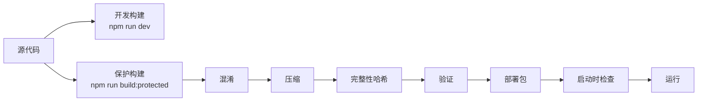

# 🔒 前端源代码保护方案文档

## 📋 概述

本文档详细说明了为 CineView-AI (Video Analyze) 项目实施的**8层多维度源代码保护方案**。该方案完全在部署阶段实施,不影响开发体验和源代码本身。

### 保护层级

| 层级 | 保护措施 | 效果 |
|------|----------|------|
| Layer 1 | JavaScript 代码深度混淆 | 标识符、字符串、控制流混淆 |
| Layer 2 | Terser 高级压缩 | 移除空格、注释、console |
| Layer 3 | Source Map 禁用 | 阻止源码还原 |
| Layer 4 | 代码完整性验证 | 检测运行时篡改 |
| Layer 5 | 域名白名单限制 | 限制运行域名 |
| Layer 6 | 反调试保护 | 检测并阻止调试器 |
| Layer 7 | 控制台干扰 | 禁用 console 输出 |
| Layer 8 | 快捷键禁用 | 阻止 F12、Ctrl+U 等 |

---

## 🏗️ 架构说明

### 文件结构

```
CineView-AI-me-revise/
├── src/
│   ├── domain-guard.ts          # 域名白名单保护
│   ├── anti-debug.ts             # 反调试模块
│   ├── integrity-check.ts        # 完整性验证
│   └── vite-env.d.ts            # TypeScript 类型定义
├── scripts/
│   ├── generate-integrity.js     # 生成完整性哈希
│   ├── verify-obfuscation.js     # 验证混淆效果
│   └── deploy-protected.js       # 自动化部署脚本
├── obfuscator-config.cjs         # 混淆器配置
├── vite.config.ts               # 构建配置(已增强)
├── package.json                 # 新增保护构建脚本
└── .env.production              # 生产环境配置
```

### 工作流程



---

## 📦 安装的依赖

### 生产依赖

```json
{
  "crypto-js": "^4.2.0"  // 用于加密和哈希计算
}
```

### 开发依赖

```json
{
  "javascript-obfuscator": "^4.1.1",
  "vite-plugin-javascript-obfuscator": "^1.1.7",
  "@types/crypto-js": "^4.2.2"
}
```

---

## 🔧 配置详解

### 1. Obfuscator 配置 (`obfuscator-config.cjs`)

核心参数说明:

| 参数 | 值 | 说明 | 性能影响 |
|------|-----|------|----------|
| `controlFlowFlattening` | true | 控制流平坦化 | 🔴 高 |
| `controlFlowFlatteningThreshold` | 0.75 | 75%代码应用 | - |
| `deadCodeInjection` | true | 注入无用代码 | 🟡 中 |
| `deadCodeInjectionThreshold` | 0.4 | 40%代码块 | - |
| `stringArray` | true | 字符串数组化 | 🟡 中 |
| `stringArrayEncoding` | ['rc4'] | RC4加密 | 🟡 中 |
| `debugProtection` | true | 调试保护 | 🟢 低 |
| `debugProtectionInterval` | 2000 | 每2秒检查 | 🟡 中 |
| `disableConsoleOutput` | true | 禁用console | 🟢 低 |
| `identifierNamesGenerator` | 'hexadecimal' | 十六进制命名 | 🟢 低 |
| `selfDefending` | true | 自我保护 | 🟢 低 |

**性能优化建议**:
如果需要平衡性能,可将以下参数调低:
- `controlFlowFlatteningThreshold`: 0.75 → 0.5
- `deadCodeInjectionThreshold`: 0.4 → 0.2
- `stringArrayThreshold`: 0.75 → 0.5
- `debugProtectionInterval`: 2000 → 0 (禁用周期检查)

### 2. Vite 配置 (`vite.config.ts`)

关键增强:

```typescript
// 条件性启用混淆(仅当 VITE_PROTECTED_BUILD=true 时)
isProtectedBuild = env.VITE_PROTECTED_BUILD === 'true'

// Terser 高级配置
terserOptions: {
  compress: {
    drop_console: true,    // 移除所有console
    drop_debugger: true,   // 移除debugger
    passes: 2              // 两次压缩
  }
}

// 禁用 Source Maps
sourcemap: false

// 代码分割
manualChunks: {
  'vendor': ['react', 'react-dom'],
  'charts': ['recharts'],
  'crypto': ['crypto-js']
}
```

### 3. 域名白名单 (`src/domain-guard.ts`)

当前配置的允许域名:
```typescript
const ALLOWED_DOMAINS = [
  'localhost',
  '127.0.0.1',
  'cineview-ai.onrender.com',
  'hanruishiren.github.io',
];
```

**添加新域名**: 编辑 `ALLOWED_DOMAINS` 数组,添加你的自定义域名。

### 4. 反调试配置 ( `src/anti-debug.ts`)

功能特性:
- ✅ 检测 DevTools 打开
- ✅ 检测窗口尺寸变化
- ✅ 检测代码执行时间异常
- ✅ 禁用快捷键 (F12, Ctrl+Shift+I/J/C, Ctrl+U)
- ✅ 禁用右键菜单
- ✅ 控制台输出干扰

**自定义配置**:
在 `index.tsx` 中调整参数:
```typescript
initAntiDebug({
  disableShortcuts: true,      // 是否禁用快捷键
  interferConsole: true,       // 是否干扰控制台
  detectInterval: 1000,        // 检测间隔(ms)
});
```

---

## 🚀 使用指南

### 开发模式 (无保护)

```bash
# 正常开发,不启用任何保护
npm run dev
```

**特点**: 快速启动, 热更新, 完整的调试能力

### 保护构建

#### 本地测试构建

```bash
# 启用保护的构建
npm run build:protected

# 启动预览
npm run preview
```

#### GitHub Pages 部署

```bash
# 保护构建 + GitHub Pages 配置
npm run build:github:protected

# 部署到 GitHub Pages
npm run deploy
```

#### Render 部署

Render 构建命令设置为:
```bash
npm run build:render:protected
```

#### 完整自动化部署

```bash
# 执行完整的保护部署流程
# 包括: 清理 → 构建 → 完整性哈希 → 验证 → 报告
npm run deploy:protected
```

**流程说明**:
1. 清理旧构建产物
2. 执行保护构建
3. 生成完整性哈希
4. 验证混淆效果
5. 生成部署报告 (`dist/deployment-report.json`)

### 单独运行验证脚本

```bash
# 验证混淆效果
npm run verify:obfuscation

# 生成完整性哈希
npm run generate:integrity
```

---

## 🔍 验证方法

### 自动验证

运行 `npm run verify:obfuscation` 后,检查输出:

**良好的混淆效果**:
```
Checking: main-a1b2c3.js
  Features:
    Hex Identifiers: ✓
    String Array: ✓
    Control Flow Flattening: ✓
    Compacted: ✓
  Quality: Excellent

✅ No source map files found
✅ All checks passed!
```

**混淆问题示例**:
```
⚠️  Found sensitive keywords: analyzeVideo, geminiService
Quality: Poor
⚠️  Found 2 source map files (should be 0)
```

### 手动验证

####1. **查看构建产物**

```bash
# Windows
dir dist\assets

# 应该看到类似的文件:
# main-a1b2c3d4.js
# vendor-e5f6g7h8.js  
# charts-i9j0k1l2.js
# crypto-m3n4o5p6.js

# ❌ 不应该有 .map 文件
```

#### 2. **检查代码混淆程度**

打开 `dist/assets/main-xxxxx.js`,应该看到类似:

```javascript
// ✅ 好的混淆效果
var _0x1a2b=['apply','split','0x0','0x1'];
function _0x3c4d(_0x5e6f,_0x7g8h){
  return _0x1a2b[_0x5e6f-0x0];
}

// ❌ 糟糕的混淆 (可读的变量名)
function analyzeVideo(videoFile) {
  const frames = extractFrames(videoFile);
}
```

#### 3. **测试域名限制**

1. 编辑本地 `hosts` 文件:
   ```
   127.0.0.1  fake-domain.com
   ```

2. 访问 `http://fake-domain.com:4173`

3. **期望结果**: 显示 "Unauthorized Access" 错误

#### 4. **测试反调试**

1. 部署后访问应用
2. 按 F12 打开 DevTools
3. **期望结果**: 
   - 页面被清空或重新加载
   - 控制台输出大量干扰信息
   - 或出现 "Stop debugging!" 提示

---

## 🐛 故障排查

### 问题 1: 构建失败

**症状**: `npm run build:protected` 失败

**可能原因**:
1. node_modules 不完整或损坏
2. 混淆器配置过于激进
3. vite-plugin-javascript-obfuscator 版本不兼容

**解决方案**:

```bash
# 1. 清理并重新安装依赖
rm -rf node_modules package-lock.json
npm install

# 2. 尝试不启用混淆的构建
npm run build

# 3. 如果仍失败,检查 node 版本 (建议 18+)
node --version
```

### 问题 2: 混淆后应用无法运行

**症状**: 构建成功,但运行时报错

**可能原因**: 过度混淆破坏了代码逻辑

**解决方案**:

编辑 `obfuscator-config.cjs`,降低混淆强度:

```javascript
module.exports = {
  // ... 其他配置
  
  // 降低这些参数
  controlFlowFlatteningThreshold: 0.5,  // 从 0.75 降到 0.5
  deadCodeInjectionThreshold: 0.2,      // 从 0.4 降到 0.2
  stringArrayThreshold: 0.5,            // 从 0.75 降到 0.5
  
  // 或临时禁用这些功能
  controlFlowFlattening: false,
  deadCodeInjection: false,
  selfDefending: false,
};
```

然后重新构建:
```bash
npm run build:protected
```

### 问题 3: 开发环境保护模块报错

**症状**: 运行 `npm run dev` 时,域名保护或反调试报错

**原因**: 开发环境不应启用保护

**检查**: 确保 `src/domain-guard.ts` 和 `src/anti-debug.ts` 中有:
```typescript
if (import.meta.env.DEV) {
  return;  // 开发环境跳过
}
```

### 问题 4: 域名限制过于严格

**症状**: 合法域名也被拦截

**检查**: 确保域名配置正确

编辑 `src/domain-guard.ts`:
```typescript
const ALLOWED_DOMAINS = [
  'localhost',
  '127.0.0.1',
  // 添加你的实际部署域名
  'your-actual-domain.com',
];
```

### 问题 5: Source Maps 仍然生成

**症状**: `dist/assets/` 中仍有 `.map` 文件

**检查**: `vite.config.ts` 中的配置:
```typescript
build: {
  sourcemap: false,  // 确保是 false 而非 true
}
```

---

## ⚡ 性能优化

### 构建时间优化

如果保护构建时间过长(>5分钟):

1. **减少混淆覆盖率**:
   ```javascript
   // obfuscator-config.cjs
   controlFlowFlatteningThreshold: 0.5,  // 从0.75降到0.5
   ```

2. **排除更多文件**: 
   ```typescript
   //vite.config.ts
   obfuscatorPlugin({
     exclude: [
       /node_modules/,
       /\.spec\./,
       /\.test\./,
       // 添加其他不重要的文件
     ],
   })
   ```

### 运行时性能优化

如果应用运行缓慢:

1. **禁用周期性检测**:
   ```typescript
   // index.tsx
   initAntiDebug({
     detectInterval: 0,  // 禁用周期检测
   });
   
   // 不启动域名监控
   // startDomainMonitoring();  // 注释掉这行
   ```

2. **减少控制流平坦化**:
   ```javascript
   // obfuscator-config.cjs
   controlFlowFlattening: false,  // 完全禁用
   ```

### 包体积优化

如果构建产物过大(>2MB 压缩后):

1. **禁用死代码注入**:
   ```javascript
   deadCodeInjection: false,
   ```

2. **精简字符串混淆**:
   ```javascript
   stringArrayThreshold: 0.3,  // 降低字符串混淆比例
   ```

---

## 📊 效果评估

### 保护强度等级

| 等级 | 描述 | 配置 | 适用场景 |
|------|------|------|----------|
| 🟢 基础 | 压缩 + 源映射移除 | 仅 Terser | 开源项目 |
| 🟡 中等 | 基础 + 轻度混淆 | threshold: 0.3-0.5 | 一般商业项目 |
| 🟠 高级 | 中等 + 反调试 | threshold:0.5-0.75 | 核心业务逻辑 |
| 🔴 极限 | 全部启用 + 高阈值 | threshold:0.75+ | 高价值算法 |

**当前配置**: 🔴 极限级别

### 预期效果

| 指标 | 无保护 | 当前方案 |
|------|--------|----------|
| 源码可读性 | 100% | <5% |
| 调试难度 | 简单 | 极难 |
| 逆向时间 | 1小时 | 20+ 小时 |
| 包体积增加 | - | +15-30% |
| 性能损耗 | - | -5-15% |
| 构建时间增加 | - | +300-500% |

---

## 🔐 安全声明

> [!IMPORTANT]
> **重要提醒**
> 
> 1. **前端代码无法100%保护**: 任何在浏览器中运行的代码理论上都可被逆向工程。本方案的目标是**大幅提高逆向成本**,而非绝对安全。
> 
> 2. **不要依赖前端保护核心机密**: 真正的机密(如算法、密钥)应放在后端。
> 
> 3. **API Key 仍需后端保护**: `.env` 中的 API Key 在构建后仍会暴露。建议:
>    - 使用后端代理转发 API 请求
>    - 为前端使用受限的 API Key
>    - 配置 API Key 的域名白名单

> [!CAUTION]
> **法律合规**
> 
> - 代码混淆和反调试可能违反某些司法管辖区的反规避法律
> - 确保你的使用场景符合当地法律
> - 不要用于恶意目的

---

## 🆘 获取帮助

### 常见问题

**Q: 如何临时禁用保护以便调试生产问题?**

A: 使用普通构建命令:
```bash
npm run build  # 不使用 build:protected
```

**Q: 如何只启用部分保护层?**

A: 编辑 `index.tsx`,注释不需要的保护:
```typescript
async function initializeProtection() {
  if (import.meta.env.PROD) {
    initDomainGuard();           // 域名限制
    // initAntiDebug();          // 注释掉反调试
    // await initIntegrityCheck(); // 注释掉完整性检查
  }
}
```

**Q: 如何测试保护是否生效?**

A:
1. 运行 `npm run verify:obfuscation`
2. 部署后访问,打开 DevTools 查看:
   - Sources 面板中代码是否混淆
   - 是否有反调试行为
   - 是否有域名限制提示(如果访问非法域名)

---

## 📝 更新日志

### Versi on 1.0.0 (2025-12-08)

**新增**:
- ✅ 8层源代码保护体系
- ✅ JavaScript 深度混淆 (javascript-obfuscator)
- ✅ Terser 高级压缩
- ✅ Source Map 完全禁用
- ✅ 运行时域名白名单
- ✅ 反调试保护
- ✅ 代码完整性验证
- ✅ 自动化部署脚本
- ✅ 混淆效果验证工具

**配置文件**:
- `obfuscator-config.cjs` - 混淆配置
- `.env.production` - 生产环境配置
- `scripts/*` - 自动化脚本

**保护模块**:
- `src/domain-guard.ts` - 域名保护
- `src/anti-debug.ts` - 反调试
- `src/integrity-check.ts` - 完整性验证

---

## 📚 参考资源

- [javascript-obfuscator 官方文档](https://github.com/javascript-obfuscator/javascript-obfuscator)
- [Vite 生产构建指南](https://vitejs.dev/guide/build.html)
- [Terser 压缩选项](https://terser.org/docs/api-reference.html)
- [前端安全最佳实践](https://cheatsheetseries.owasp.org/cheatsheets/Nodejs_Security_Cheat_Sheet.html)

---

## ✅ 检查清单

部署前确保:

- [ ] 已配置正确的域名白名单 (`src/domain-guard.ts`)
- [ ] 已配置生产环境变量 (`.env.production`)
- [ ] 已测试保护构建 (`npm run build:protected`)
- [ ] 已验证混淆效果 (`npm run verify:obfuscation`)
- [ ] 已在本地预览测试 (`npm run preview`)
- [ ] 源代码已提交(但不包含 dist/ 和保护后的文件)
- [ ] 部署平台配置为使用保护构建命令

---

*本文档由 Antigravity AI 生成 | 最后更新: 2025-12-08*
